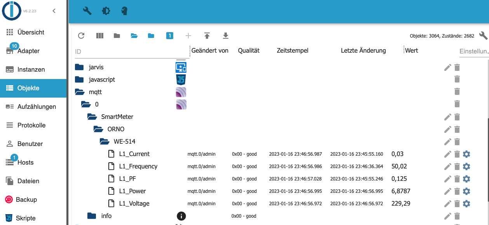

#### ORNO Class 

> Required packages
```
Install the required packages if not already installed:

pip3 install minimalmodbus
pip3 install pyserial
pip3 install random
pip3 install paho-mqtt
```

#### Available methods and parameters
> instrument = orno.orno(port, slave_id=1, useMQTT=False)
```
port        Serial Device like COM4 or /dev/ttyUSB0

slave_id    The ID of the Modbus Device to communicate to

useMQTT     True or False, if True it is necessary to set MQTT communication parameters
            mqtt_broker         IP address or hostname of MQTT server
            mqtt_port           the port of the MQTT broker
            mqtt_topic          the main topic where the ORNO objects L1_volage etc being published
            mqtt_username       the username for MQTT broker authentication
            mqtt_password       the password for MQTT broker authentication

Other parameters
            debug               True/False, for debug output
            polling_interval    number in seconds between each query of the target device

```

> instrument.query()
```
This method will gather L1 Voltage, L1 Current, L1 Power, L1 PowerFactor, L1 Frequence.
The communication is done one time.
```

> instrument.print()
```
The method will output L1 Voltage, L1 Current, L1 Power, L1 PowerFactor, L1 Frequence.
The method instrument.query() must be executed before.
```

> instrument.doLoop(count=0,initite=True)
```
Without any given parameters the method will do a query every polling_interval seconds initinite. 
If MQTT is used the gathered information is sent to the MQTT broker.

count       (int)  set the number of queries if set greater than 0, otherwise infinte query.
infinite    (bool) True/False - do infinite query or not
```

> instrument.mqtt_enable()
```
Connects to the MQTT broker   
```

> instrument.mqtt_publish()
```
Publishes the last retrieved data from instrument.query() to the MQTT broker. 
```

> Sample hardware (Raspberry Pi, RS-485 Module, Wiring, Connection)

> Samples 

##### Sample infinite loop and sending to MQTT Broker

```
import orno

instrument=orno.orno('/dev/ttyAMA0',useMQTT=True)

instrument.mqtt_broker       = 'broker-hostname'
instrument.mqtt_port         = 1886
instrument.mqtt_username     = 'user'
instrument.mqtt_password     = 'password'
instrument.mqtt_topic        = 'SmartMeter/ORNO/WE-514'
instrument.debug             = False
instrument.polling_interval  = 10

instrument.doLoop()
```


##### Sample query with count (100 times every 10 seconds) and sending to MQTT Broker

```
import orno

instrument=orno.orno('/dev/ttyAMA0',useMQTT=True)

instrument.mqtt_broker       = 'broker-hostname'
instrument.mqtt_port         = 1886
instrument.mqtt_username     = 'user'
instrument.mqtt_password     = 'password'
instrument.mqtt_topic        = 'SmartMeter/ORNO/WE-514'
instrument.debug             = False
instrument.polling_interval  = 10

instrument.doLoop(count=100)
```


##### Sample to check connection and print results

```
import orno

instrument=orno.orno('/dev/ttyUSB0', slave_id=10, useMQTT=False)
instrument.query()
instrument.print()
```
###### Result
```
L1 Voltage       229.37 V
L1 Frequency     50.03 Hz
L1 Current       0.030 A
L1 Power         6.881 W
L1 Power Factor  0.125
>>>
``` 