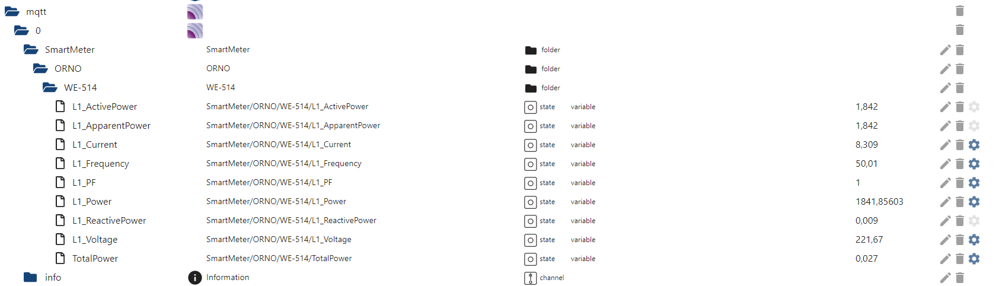

# ORNO package 

> With the orno python3 class it is very easy to communicate with the ORNO OR-WE-514 meter via RS-485 and ModBus RTU protocol. 
> The intention was to make it very easy. Basically you need the class init with defaults and get going. The defaults should be
> sufficient to communicate with the device. If you're going to use MQTT a view parameters for authentication and connection have
> to be set and that's it. 
>
> Together with iobroker or similar software you can display the datapoints:



> I used a RS-485 modul and build an easy RS-485 hat to my Raspberry Pi 1. 
>
> Important note:   connect Pi Pin TX to Module TX and Pi RX to Module RX 
>                   (that might change in these modules later as it is confusing)
>                   Connect Hat B- to OR-WE-514 Pin 25
>                   Connect Hat A+ to OR-WE-514 Pin 23
>                   Ground is not needed
>                   Do not forget to connect one of the two Neutral wires to your grid neutral, otherwise it will not work.


> Required packages
```
Install the required packages if not already installed:

pip3 install minimalmodbus
pip3 install pyserial
pip3 install random
pip3 install paho-mqtt
```

### Available methods and parameters
> instrument = orno.orno(port, slave_id=1, useMQTT=False, log=True)
```
port        Serial Device like COM4 or /dev/ttyUSB0

slave_id    The ID of the Modbus Device to communicate to

useMQTT     True or False, if True it is necessary to set MQTT communication parameters
            mqtt_broker         IP address or hostname of MQTT server
            mqtt_port           the port of the MQTT broker
            mqtt_topic          the main topic where the ORNO objects L1_volage etc being published
            mqtt_username       the username for MQTT broker authentication
            mqtt_password       the password for MQTT broker authentication

log         True/False
            Writes out a logfile in current execution folder. Setting degub=True makes it more verbose.

Other parameters
            debug               True/False, for debug output
            polling_interval    number in seconds between each query of the target device

```

> value = instrument.query(register=0, decimals=2)
```
This method will gather L1 Voltage, L1 Current, L1 Power, L1 Active Power, L1 Reactive Power, L1 Apparent Power, 
L1 PowerFactor, L1 Frequency and Total Power.
The communication is done one time.

To query single register use a known value for register and its decimals or use predefined register variables:
orno.L1_Frequency     
orno.L1_Voltage       
orno.L1_Current       
orno.L1_Power         
orno.L1_PF            
orno.L1_ActivePower   
orno.L1_ReactivePower 
orno.L1_ApparentPower 
orno.TotalPower   

Sample
TotalPower = instrument.query(orno.TotalPower,3)

```

> instrument.print()
```
The method will output L1 Voltage, L1 Current, L1 Power, L1 PowerFactor, L1 Frequence.
The method instrument.query() must be executed before.
```

> instrument.doLoop(count=0,initite=True)
```
Without any given parameters the method will do a query every polling_interval seconds initinite. 
If MQTT is used the gathered information is sent to the MQTT broker.

count       (int)  set the number of queries if set greater than 0, otherwise infinte query.
infinite    (bool) True/False - do infinite query or not
```

> instrument.mqtt_enable()
```
Connects to the MQTT broker   
```

> instrument.mqtt_publish()
```
Publishes the last retrieved data from instrument.query() to the MQTT broker. 
```

> Sample hardware (Raspberry Pi, RS-485 Module, Wiring, Connection)

### Samples 

> Sample infinite loop and sending to MQTT Broker

```
import orno

instrument=orno.orno('/dev/ttyAMA0',useMQTT=True)

instrument.mqtt_broker       = 'broker-hostname'
instrument.mqtt_port         = 1886
instrument.mqtt_username     = 'user'
instrument.mqtt_password     = 'password'
instrument.mqtt_topic        = 'SmartMeter/ORNO/WE-514'
instrument.debug             = False
instrument.polling_interval  = 10

while True:
  try:
    instrument.doLoop()
  except:
    instrument.mqtt_enable()
```


> Sample query with count (100 times every 10 seconds) and sending to MQTT Broker

```
import orno

instrument=orno.orno('/dev/ttyAMA0',useMQTT=True)

instrument.mqtt_broker       = 'broker-hostname'
instrument.mqtt_port         = 1886
instrument.mqtt_username     = 'user'
instrument.mqtt_password     = 'password'
instrument.mqtt_topic        = 'SmartMeter/ORNO/WE-514'
instrument.debug             = False
instrument.polling_interval  = 10

instrument.doLoop(count=100)
```


> Sample to check connection and print results

```
import orno

instrument=orno.orno('/dev/ttyUSB0', slave_id=10, useMQTT=False)
instrument.query()
instrument.print()
```
> Result
```
L1 Voltage       229.37 V
L1 Frequency     50.03 Hz
L1 Current       0.030 A
L1 Power         6.881 W
L1 Power Factor  0.125
>>>
``` 

> Sample to query custom registers
```
import orno

instrument=orno.orno('/dev/ttyAMA0')

Voltage = instrument.query(orno.L1_Voltage,2)
Power   = instrument.query(orno.L1_Power,3)
APower  = instrument.query(orno.L1_ActivePower,3)
RPower  = instrument.query(orno.L1_ReactivePower,3)
ApPower = instrument.query(orno.L1_ApparentPower,3)
SumPower= instrument.query(orno.TotalPower,3)

print(f"L1 Voltage       : {Voltage} V")
print(f"L1 Power         : {Power} W")
print(f"L1 Active Power  : {APower} kW")
print(f"L1 Reactive Power: {RPower} kvar")
print(f"L1 Apparent Power: {ApPower} kva")
print(f"Total Power      : {SumPower} kWh")
```
> Result
```
L1 Voltage       : 228.27 V
L1 Power         : 6.8481 W
L1 Active Power  : 0 kW
L1 Reactive Power: 0.007 kvar
L1 Apparent Power: 0.007 kva
Total Power      : 0.023 kWh
```

>
> Author: Marc-Oliver Blumenauer 
>         marc@l3c.de

### License: MIT
